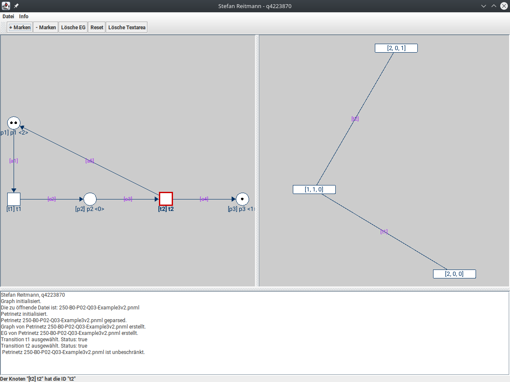

# Petrinet Application 

The developed application program in the programming language Java is a tool, with which given Petri nets can be displayed and algorithms for the computation of certain characteristics can be applied to it. The program offers the possibility to load Petri nets from **PNML-Files**, to pick up the data structures accordingly and to make them available in a graphical user interface. The loaded Petri nets can be edited by the user on the basis of the user interface. Likewise, transitions can be switched dynamically in order to examine the dynamics of the net. The core property of Petri nets, the boundedness, can be performed both graphically and as textual batch processing for a large number of nets.

The program is based on the library [GraphStream](https://graphstream-project.org/) , which is used to display Petri nets and their associated (partial) reachability graphs. The Petri nets are read on a completely self-developed data structure, which provides all functionalities to perform the constraint analysis. The code is commented and described by a JavaDoc.

## Usage

Central for the control of all operations of the program is the graphical user interface. 

This is composed of a menu bar, a toolbar, two main frames and a textarea to display relevant information. The file button of the menu bar contains the following items:

1. **Open file** Provides the possibility to read in a single PNML file via a JDialog.
2. **Reload** Completely reloads the previously opened file to restore the default values
3. **Analyze multiple files** Allows multiple files to be selected and read, with the processing foregoing the graphical visualization and providing information via textual information
4.  **Exit** Closes the program

The additional button info holds supplementary information about the software and the programmer.

In addition to the menu bar, the toolbar plays an immediate role for the direct application. This is subdivided into the following items:

1. **marker+** Adds marker to a selected location. Marker becomes new start marker.
2. **marker-** Reduces marker of a selected location. Marker becomes new start marker.
3. **Delete EG** Deletes the reachability graph generated until then.
4. **Reset** Resets all markers to the start marker.
5. **Delete Textarea** Deletes all contents of the textarea of the main window.

The basic operation of the application program can be divided into two parts:

- single processing of one Petri net with graphical representation.
- batch processing of several nets with textual output

In single processing, specific Petri nets can be loaded and graphically visualized. The visualization is done within the GUI. Locations can be selected with a left mouse click, which creates a red border. With this selection, the markers can be changed using the corresponding buttons of the toolbar. If transitions are clicked with a left mouse click, they will be activated, as far as the mesh allows this. Places as well as transitions can be moved by keeping the left mouse button pressed.

